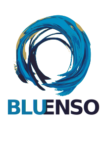

  

 

**Embedded software engineering** — automotive, IoT, AI and industrial systems.

17+ years building production-grade software at the intersection of hardware and software: from bare-metal firmware to cloud-connected platforms.

---

### What we do

- **Embedded & firmware** — C/C++, RTOS, BSP, device drivers
- **Automotive** — AUTOSAR, diagnostics (UDS/OBD), ECU development
- **IoT & connectivity** — protocol stacks, edge computing, sensor integration
- **AI integration** — on-device inference, LLM-powered tooling, data pipelines
- **Backend & tooling** — Python, Django, REST APIs, automation scripts

---

### Get in touch

[bluenso.io](https://bluenso.io) · mario.signorino@bluenso.io
